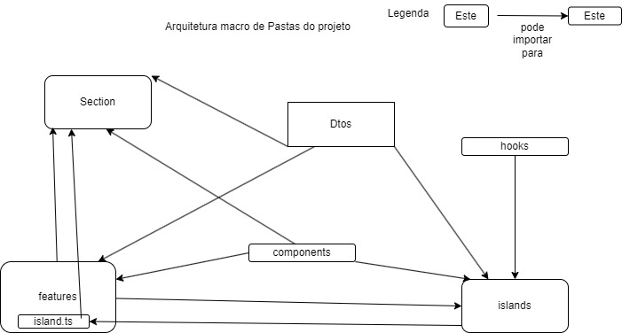

# Projeto teste Guidance 


## rodar o projeto em dev

1 - [Instalar o Deno](https://docs.deno.com/runtime/manual/getting_started/installation/)


2 - Rodar comando

```sh
deno task start
```

Isso vai instalar as dependecias e inicializar o projeto.

Accessar `http://localhost:8000` para ver o site.


### Url do projeto
https://samtestguidance.deco.site


### Arquitetura de Pastas
Foi feita uma arquitetura de pastas para padronizar o projeto descrita no diagrama abaixo


